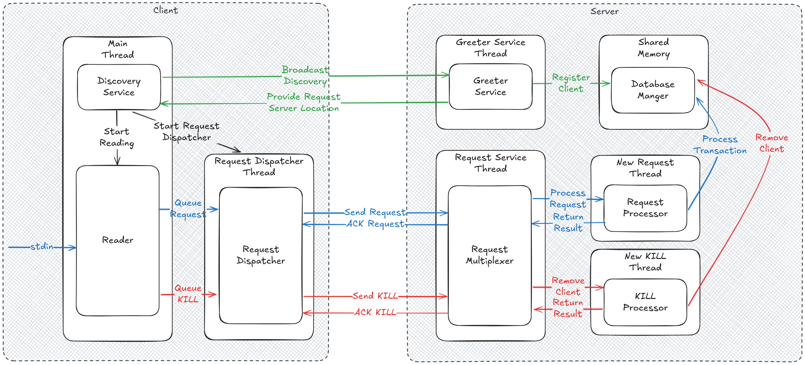

# Trabalho pratico de Sisop II - Brix

## BRICS Instant payment system

Sistema de tranferência bancária instantânea e eficiente entre clientes

## Etapa 1

### Servidor único, múltiplos clientes, suporte a concorrência e multi-thread

# Build

## Requisitos

Ver shell.nix

## Comando para compilar projeto

```
./urubu.sh build
```

## Comando para executar o projeto

```
./urubu.sh server <porta>
```

```
./urubu.sh client <porta>
```

# Formato de mensagens

De um modo geral, uma mensagem é um datagrama UDP enviado de uma parte para outra no sistema.

Todas as mensagem serão codificadas em ASCII e possuirão o mesmo tamanho ASCII, utilizando um terminador como forma de indicar seus finais. Essa escolha se dá para facilitar o debugging, uma vez que permite que mensagens sejam inspecionadas como strings, ao custo de um pouco de performance.

TODO: Decidir o tamanho máximo de uma mensagem. Vale fazer uma conta simples, de quanto é o máximo que cada campo pode ocupar.

Uma mensagem sempre começa pelo header `#!`, seguido de uma lista de campos separados pelo caracter `,` e por fim do terminador `\r\n`.

Os campos presentes em uma mensagem são os seguintes, em ordem:

 `SENDER_IP`, indicando o ip do emissor da mensagem.
- Uma lista de argumentos opcionais `<ARG1>;<ARG2>; ...; <ARGN>`, encapsulada em chaves `[]` e com argumentos separados por `;`.
- `TIMESTAMP`, indicando quando a mensagem foi enviada, e codificada como uma UNIX timestamp.
- `MSG_TYPE`, indicando qual o tipo de mensagem (descoberta - `DSC`, localização - `LOC`, requisição - `REQ` ou ack - `ACK`).

`#!<SENDER_IP>,<TIMESTAMP>,<MSG_TYPE>,[<ARG1>;<ARG2>;...;<ARGN>]\r\n`

Mensagens podem ser divididas em duas categorias, com base no emissor e receptor: Cliente -> Servidor e Servidor -> Cliente

## Cliente -> Servidor

Existem dois tipos de mensagens que podem ser enviados do cliente para o servidor:

- Descoberta (`DSC`): Pede em qual IP o servidor está atendendo requisições.
    - Argumentos: `[]`
    
- Requisição (`REQ`): Solicita o servidor que realize uma transferência para a conta de outro cliente.
    - Argumentos:  `[<RECEIVER_ACCOUNT_IP>, <AMOUNT>]`
        - `RECEIVER_ACCOUNT_IP`: Ip de destino da transferência.
        - `AMOUNT`: Quantidade inteira a ser transferida.

## Servidor -> Cliente
./
Existem dois tipos de mensagens que podem ser enviados do servidor para o cliente:

- Localização (`LOC`): Informa em qual IP e porta o servidor está escutando por requests.
    - Argumentos: `[<SERVER_IP>, <SERVER_PORT>]`
        - `SERVER_IP`: o IP no qual o servidor está escutando requisições.
        - `SERVER_PORT` a porta na qual o servidor está escutando requisições.

- ACK (`ACK`): Informa que o servidor recebeu o pedido de transação de um cliente, bem como o resultado dela.
    - Argumentos: `[<RESULT>, <LAST_PROCESSED_ID>, <CLIENT_NEW_BALANCE>] `
        - `RESULT`: Resultado da operação. Pode ser `SUCC` (success), indicando que o valor foi transferido corretamete; `FAIL` (failure), indicando que a transferência não pode ser realizado por falta de saldo; ou `B_ID` (Bad ID), indicando que o ID da mensagem não é o esperado.
        - `LAST_PROCESSED_ID`: o id da última requisição processada. Em caso de `SUCC` ou `FAIL`, o id deve ser igual ao ID da requisição enviada pelo cliente, indicando que ela foi processada corretamente (mesmo que a transferência não possa ter sido realizada). Em caso de `B_ID`, esse campo serve para indicar ao cliente que ocorreu um erro durante a transmissão de alguma mensagem.
        - `CLIENT_NEW_BALANCE`: O saldo atualizado do cliente após a operação.

## O que está sendo feito agora

### Brodacast UDP pra achar IP do servidor

# System architecture
